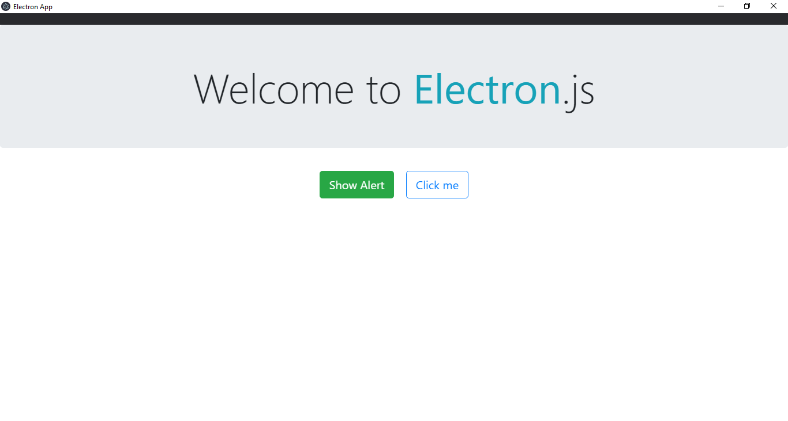
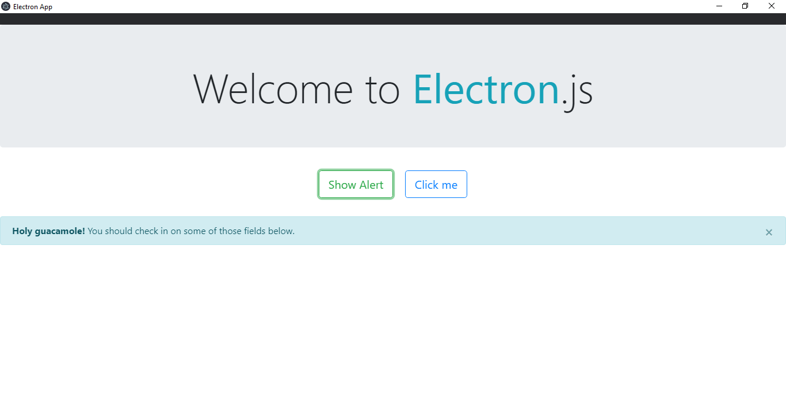
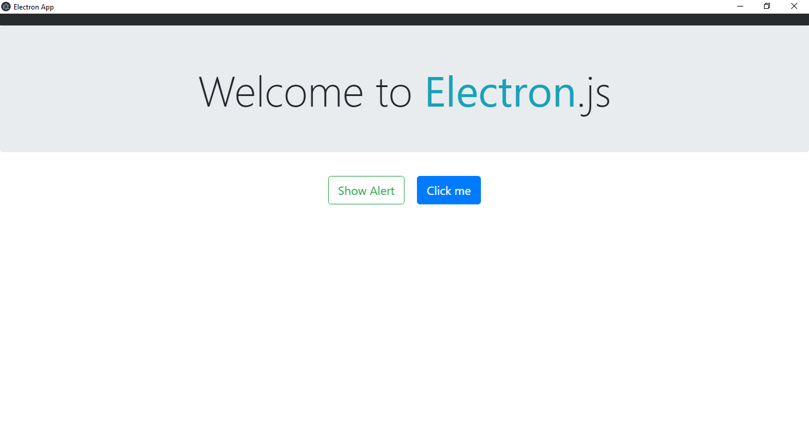
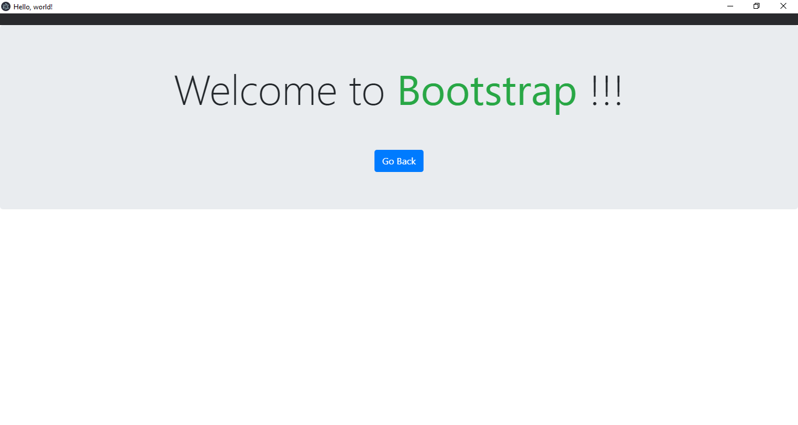

# Simple Electron App.

## Description.

This is the siple electron app for getting started with electron with out doing extra work. Just clone the app and run it :)

## How To Install.

- First you need to install node.js inorder to install electron.
- Then, clone the project and save where ever you want.
- Onen the terminal and navigate to the projects folder created in the above step.
- Now, run the following Commands.

### Commands.

```cmd
REM testing weather node is installed or not!
REM if version number is shown then node is installed successfully and you are clear to proceed further.
npm -v
node -v

REM installing electron using npm
npm install --save electron

REM run the app...
npm start
```

## Interfaces.

### Total Interfaces

- index.html
- home.html

Main Screen


Displaying Alert


Loading New Page.


Loaded new screen.

