# Client Manager.

## Description.
Clinet manager is the simple web-app for Managing clients information. It is just a simple application created for just experimenting with web techlonogies.

This project seems like a basic and simple application but it requires a handsome ammount of skills and time to build and test every single functionality.  

## Application Functionality.
* Login & Logout.
* Add, Update, and Delete Client. 

## Interfaces.
* Login
* Signup
* User Home
* Add Client
* Update Client
* Logout.

## Technologies Used.
* HTML
* Bootstrap
* PHP
* Mysql

---
## Screen Shots...

### 1. Login
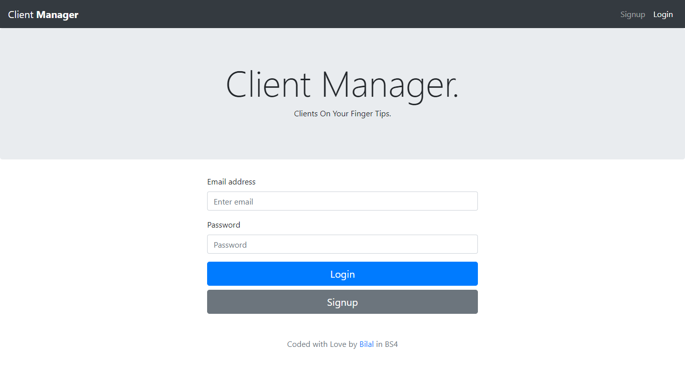

### 2. Signup
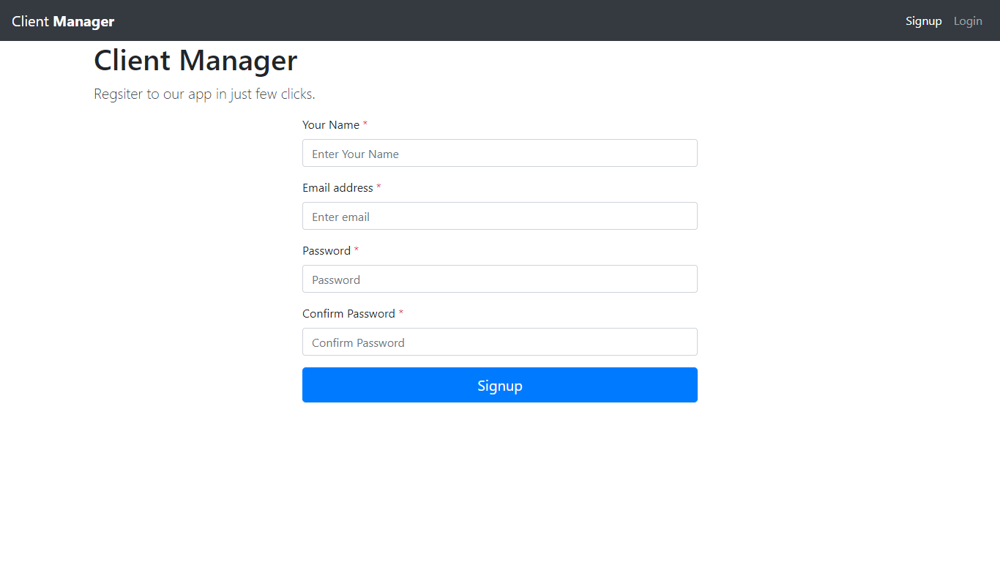

### 3. After Account Creation
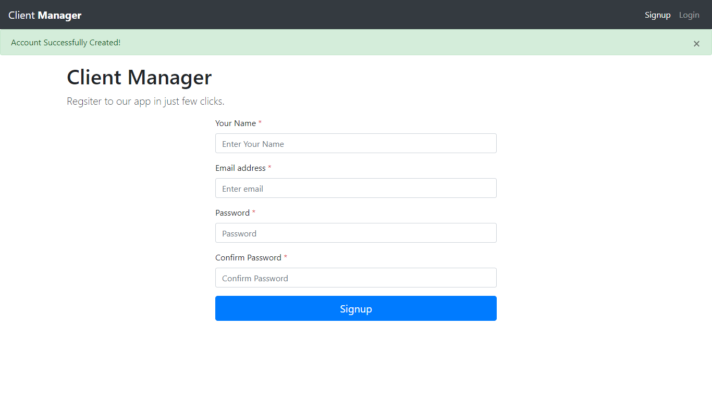

### 4. View Client
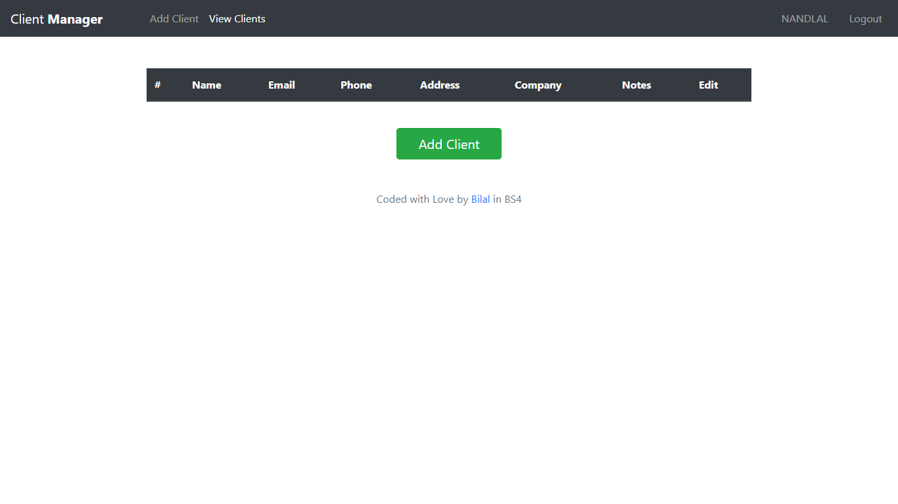

### 5. Add Client
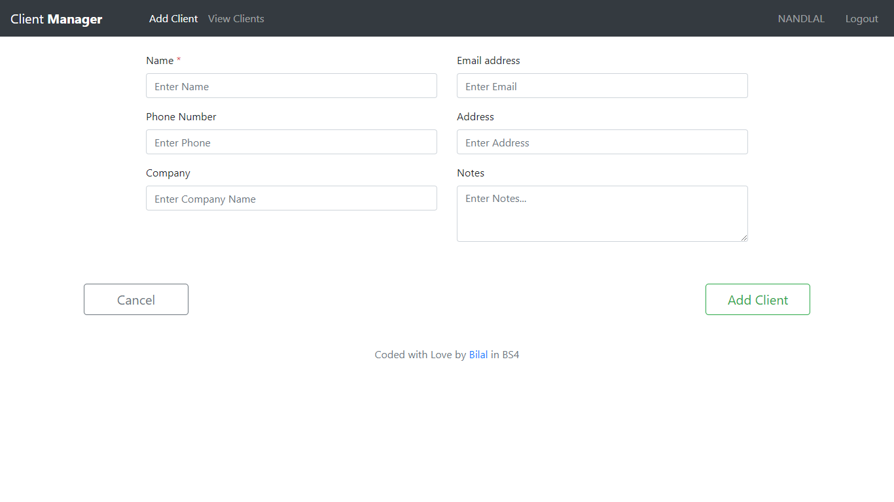

### 5. Client Added Success Message
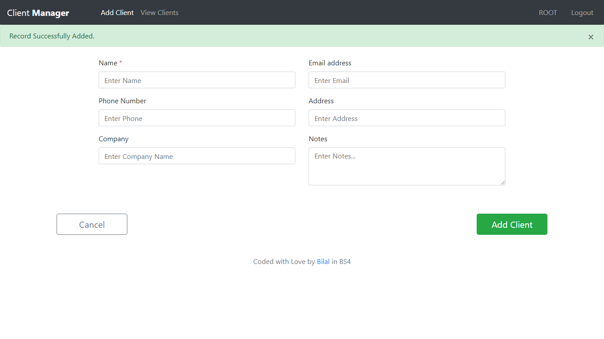

### 6. View Clients After Adding some Clients
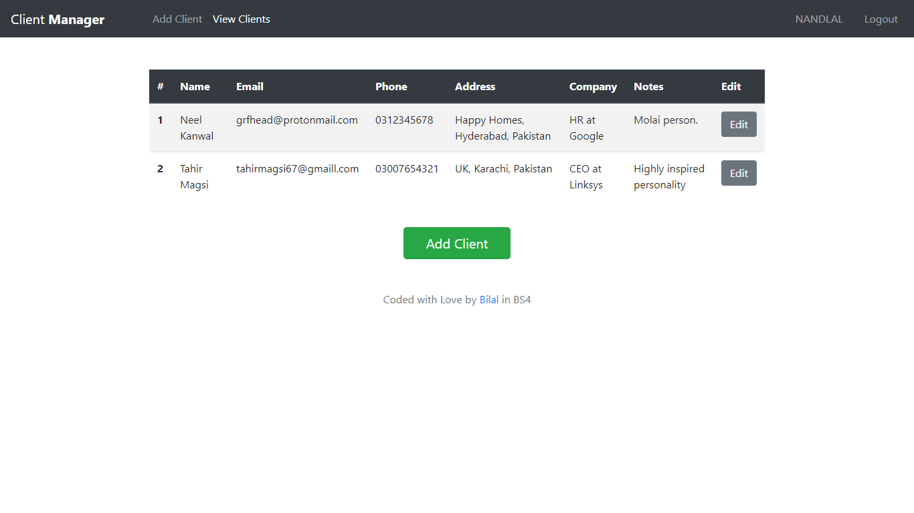

### 7. Update Client 
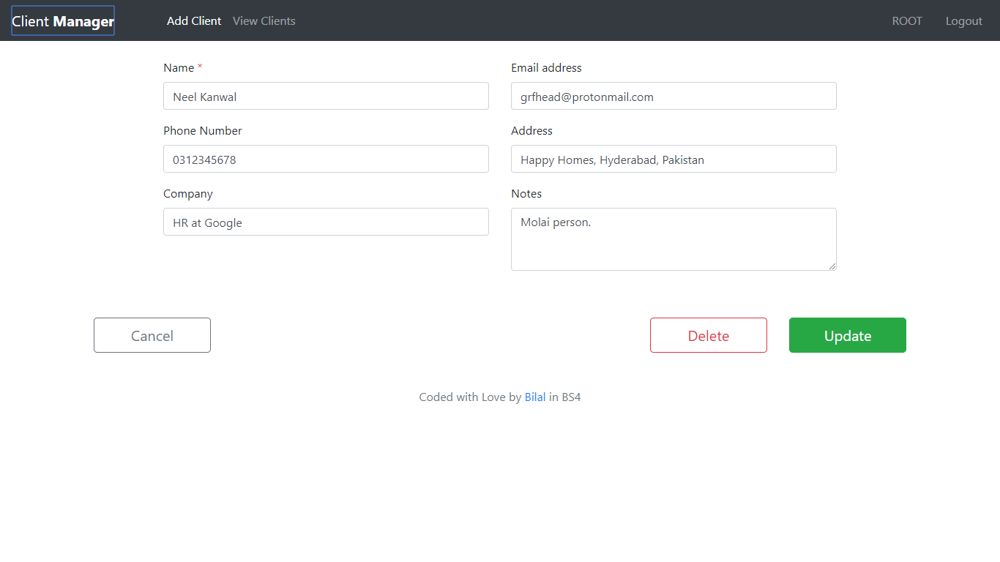

### 8. After Updating Client 
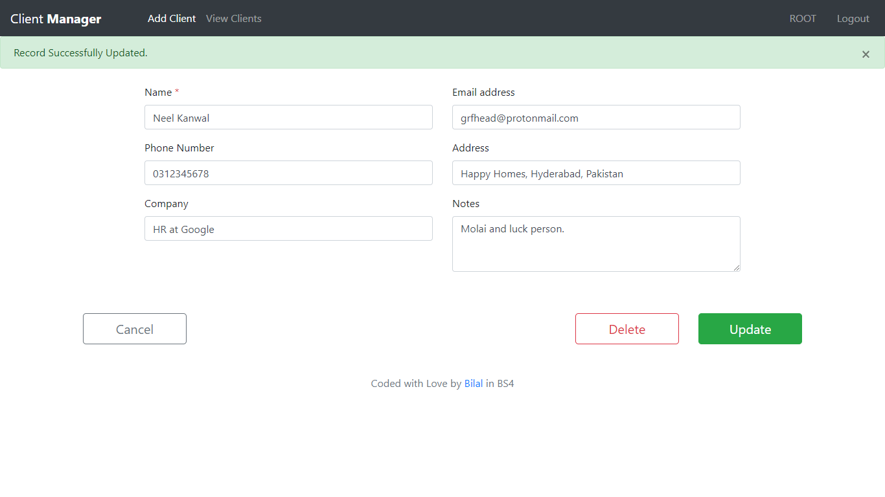

### 9. Deleting Client
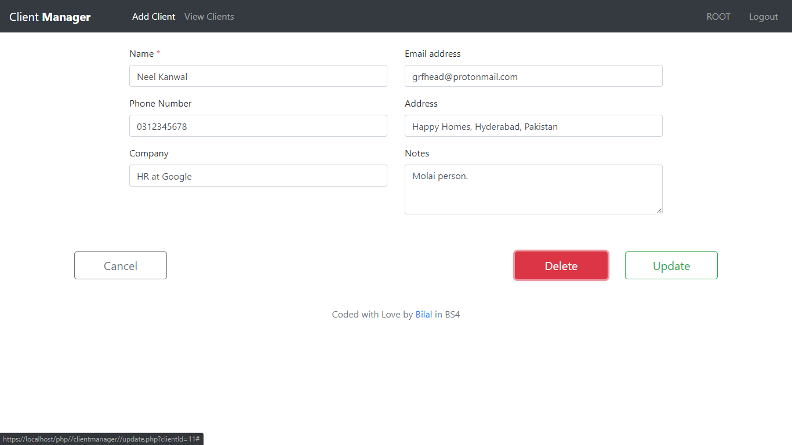

### 10. Delete Confirmation Dialog
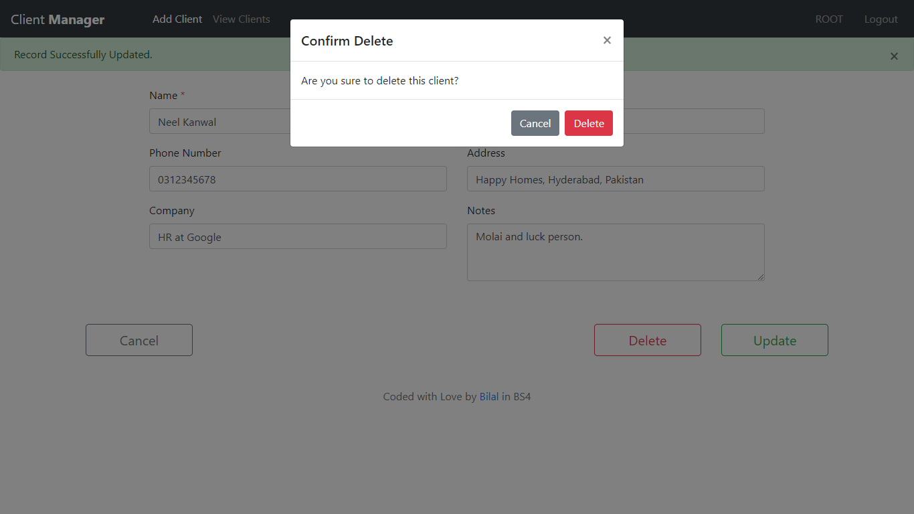

### 11. Logout
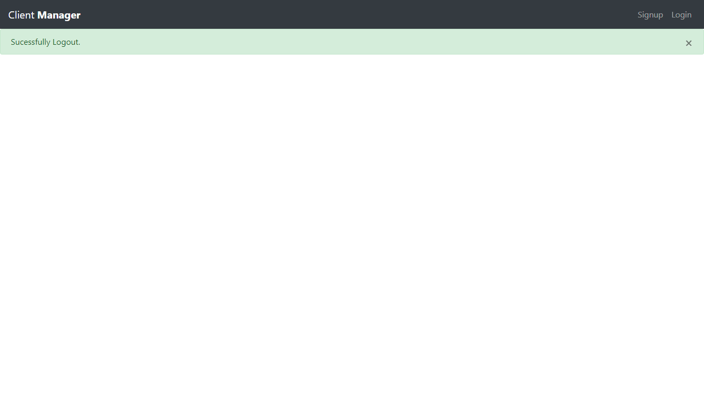

