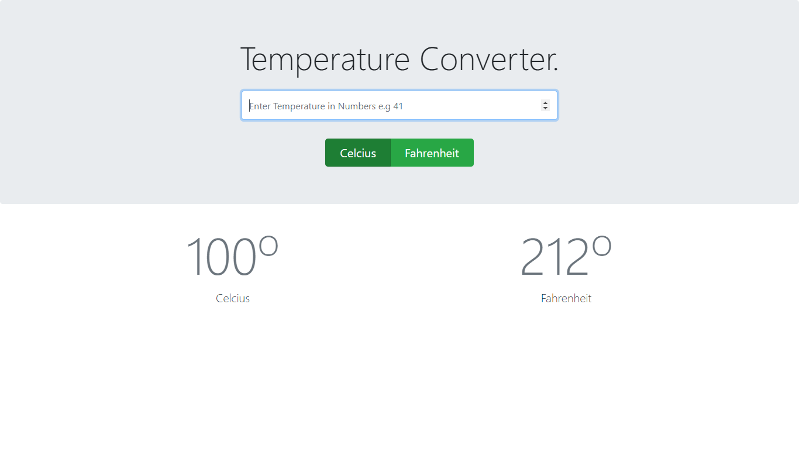
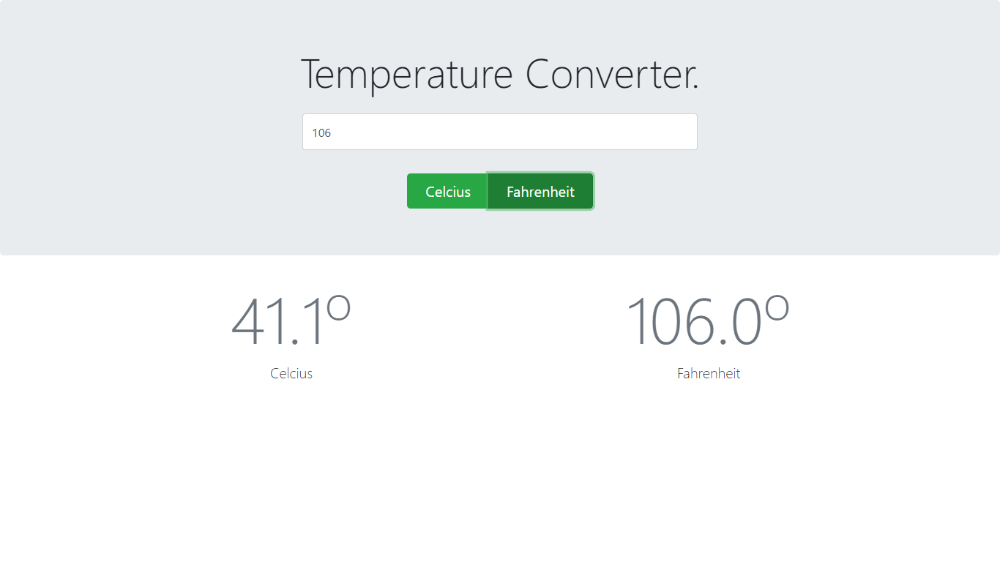
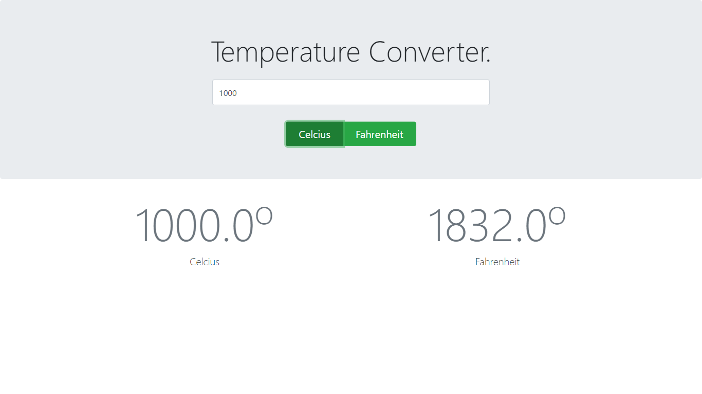

# Simple Temperature Converter.

## Description
It is a simple temperature converter page build in using following technologies.

## Technology Used.
* HTML
* Bootstrap
* Java Script

## User Interfaces

Simple Main Screen

Converting Fahrenheit to Celicus

Converting Celcius to Fahrenheit.

