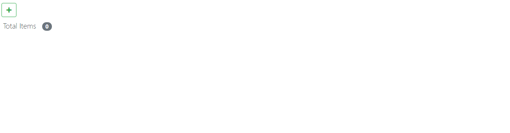
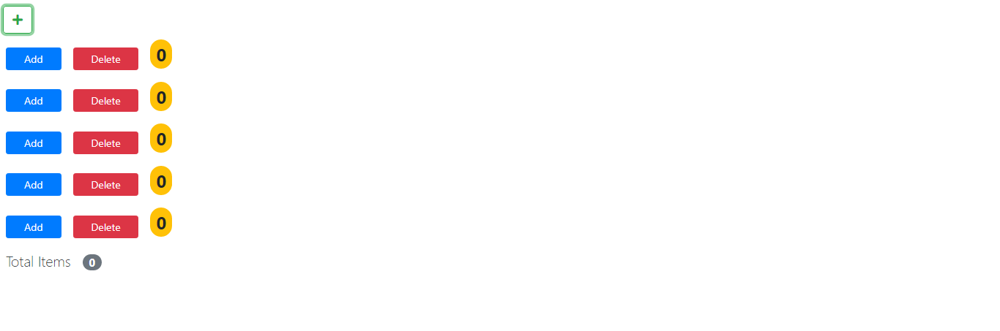
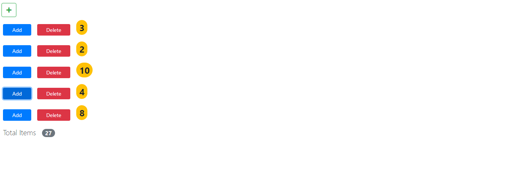
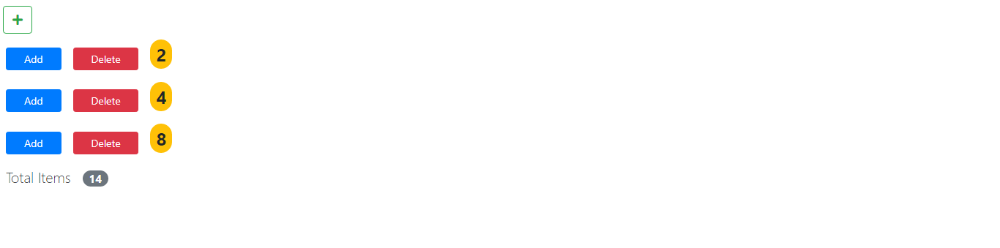

# Simple React Counter Component.

This is just a basic component for the testing purpose.

## Structure - internal components

- Counter [Basic Component]
  - show count
  - increment count &
  - delete counter
- Counters [Container Component]
  - Holds Counters &
  - Display Total Count

## UI - user interfaces

Adding Counter.

Counters Added.

Changing the state of Counter.

Deleting the Counter.

