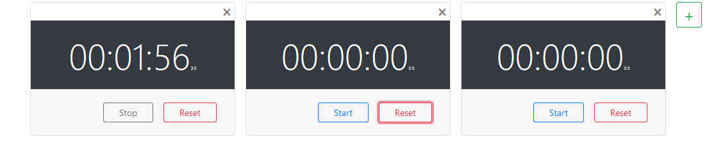

# Title
Simple Stopwatch Component

> Tags: Javascript | React | Component | Stopwatch

### Description
A simple react stopwatch component. Mimic functionality of stopwatch. Simple flat UI which provides easiness. UI provides three[3] visible elements: Timer Panel, Start/Stop Button, and Reset button.  

### Technologies Used
- Javascript
- HTML
- Bootstrap
- React

### Motivation
Designed and implemented just to exprement with react how it works in short due to learning purpose.

### Future Work
- Refactoring
- Theme selection functionality.
- Increase Responsiveness.

### Functionalities
- Add Timer
- Start Timer
- Stop Timer
- Reset Timer
- Delete Timer

### How to use?
- Clone this repository.
- Download Dependencies. _> npm install
- Start Project. _> npm start  

### User Interfaces:

